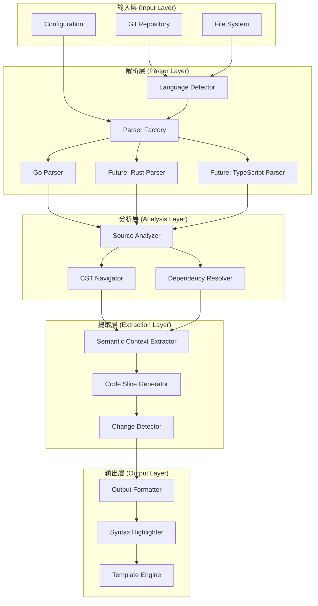

# semantic-diff 多语言架构文档

## 概述

semantic-diff 是一个基于 Rust 构建的多语言代码差异分析工具，采用模块化的架构设计，支持多种编程语言的语义分析。本文档详细介绍了系统的架构设计、组件交互和扩展机制。

## 架构概览

### 整体架构图



### 分层架构详解

#### 1. 输入层 (Input Layer)
负责处理各种输入源和配置信息。

**主要组件：**
- **Git Repository Handler**: 处理 Git 仓库操作，解析提交差异
- **File System Interface**: 处理文件系统操作，读取源代码文件
- **Configuration Manager**: 管理系统配置和用户偏好设置

#### 2. 解析层 (Parser Layer)
核心的多语言解析架构，支持动态语言检测和解析器创建。

**主要组件：**
- **Language Detector**: 根据文件扩展名和内容检测编程语言
- **Parser Factory**: 工厂模式创建对应语言的解析器
- **Language Parsers**: 各种语言特定的解析器实现

#### 3. 分析层 (Analysis Layer)
对解析后的代码进行语义分析和依赖关系解析。

**主要组件：**
- **Source Analyzer**: 通用的源文件分析器
- **CST Navigator**: 具体语法树导航器
- **Dependency Resolver**: 依赖关系解析器

#### 4. 提取层 (Extraction Layer)
提取变更相关的语义上下文和生成代码切片。

**主要组件：**
- **Semantic Context Extractor**: 语义上下文提取器
- **Code Slice Generator**: 代码切片生成器
- **Change Detector**: 变更检测器

#### 5. 输出层 (Output Layer)
格式化输出结果，支持多种输出格式。

**主要组件：**
- **Output Formatter**: 输出格式化器
- **Syntax Highlighter**: 语法高亮器
- **Template Engine**: 模板引擎

## 核心组件详解

### 1. 多语言解析器架构

#### LanguageParser Trait
所有语言解析器都必须实现的通用接口：

```rust
pub trait LanguageParser: Send + Sync {
    /// 解析源码为语法树
    fn parse_source(&mut self, source: &str) -> Result<Tree>;
    
    /// 根据行列位置查找节点
    fn find_node_at_position<'a>(&self, tree: &'a Tree, line: u32, column: u32) -> Option<Node<'a>>;
    
    /// 获取节点的文本内容
    fn get_node_text<'a>(&self, node: Node, source: &'a str) -> &'a str;
    
    /// 遍历语法树
    fn walk_tree<F>(&self, root: Node, callback: F) where F: FnMut(Node);
    
    /// 获取语言名称
    fn language_name(&self) -> &'static str;
    
    /// 获取支持的文件扩展名
    fn file_extensions(&self) -> &'static [&'static str];
}
```

#### Parser Factory
使用工厂模式管理解析器的创建：

```rust
pub struct ParserFactory;

impl ParserFactory {
    /// 根据语言类型创建解析器
    pub fn create_parser(language: SupportedLanguage) -> Result<Box<dyn LanguageParser>>;
    
    /// 根据文件路径检测语言类型
    pub fn detect_language(file_path: &Path) -> Option<SupportedLanguage>;
    
    /// 根据文件路径创建对应的解析器
    pub fn create_parser_for_file(file_path: &Path) -> Result<Box<dyn LanguageParser>>;
}
```

### 2. 语言特定信息系统

#### LanguageSpecificInfo Trait
用于存储语言特定的元数据：

```rust
pub trait LanguageSpecificInfo: Send + Sync {
    fn as_any(&self) -> &dyn std::any::Any;
}
```

#### Go 语言特定信息
```rust
pub struct GoLanguageInfo {
    pub package_name: String,
    pub imports: Vec<Import>,
    pub declarations: Vec<Declaration>,
}

impl LanguageSpecificInfo for GoLanguageInfo {
    fn as_any(&self) -> &dyn std::any::Any {
        self
    }
}
```

### 3. 通用源文件分析器

#### SourceAnalyzer
提供语言无关的分析接口：

```rust
pub struct SourceAnalyzer {
    parser: Box<dyn LanguageParser>,
}

impl SourceAnalyzer {
    /// 根据文件路径创建分析器
    pub fn new_for_file(file_path: &Path) -> Result<Self>;
    
    /// 根据语言类型创建分析器
    pub fn new_for_language(language: SupportedLanguage) -> Result<Self>;
    
    /// 分析文件
    pub fn analyze_file(&mut self, file_path: &Path) -> Result<SourceFile>;
    
    /// 查找变更的函数
    pub fn find_changed_functions(&self, file: &SourceFile, hunks: &[DiffHunk]) -> Result<Vec<FunctionInfo>>;
}
```

### 4. 语义上下文提取

#### SemanticContextExtractor
提取变更代码的完整语义上下文：

```rust
pub struct SemanticContextExtractor {
    dependency_resolver: DependencyResolver,
}

impl SemanticContextExtractor {
    pub fn extract_context(&self, function: &FunctionInfo, source_files: &[SourceFile]) -> Result<SemanticContext>;
}

pub struct SemanticContext {
    pub main_function: FunctionInfo,
    pub related_types: Vec<TypeDefinition>,
    pub dependent_functions: Vec<FunctionInfo>,
    pub constants: Vec<ConstantDefinition>,
    pub imports: Vec<Import>,
}
```

## 使用示例

### 基本使用流程

```rust
use semantic_diff_core::{
    analyzer::SourceAnalyzer,
    extractor::SemanticContextExtractor,
    generator::CodeSliceGenerator,
    git::GitDiffParser,
    parser::SupportedLanguage,
};

fn main() -> Result<(), Box<dyn std::error::Error>> {
    // 1. 解析 Git 差异
    let git_parser = GitDiffParser::new("./my-project".into())?;
    let file_changes = git_parser.parse_commit("abc123")?;
    
    // 2. 分析变更的文件
    let mut analyzer = SourceAnalyzer::new_for_language(SupportedLanguage::Go)?;
    
    for file_change in &file_changes {
        if file_change.file_path.extension().and_then(|s| s.to_str()) == Some("go") {
            // 分析文件
            let source_file = analyzer.analyze_file(&file_change.file_path)?;
            
            // 查找变更的函数
            let changed_functions = analyzer.find_changed_functions(&source_file, &file_change.hunks)?;
            
            // 3. 提取语义上下文
            let extractor = SemanticContextExtractor::new();
            
            for function in &changed_functions {
                let context = extractor.extract_context(function, &[source_file.clone()])?;
                
                // 4. 生成代码切片
                let generator = CodeSliceGenerator::new();
                let code_slice = generator.generate_slice(&context, &file_change.hunks)?;
                
                println!("Function: {}", function.name);
                println!("Code slice generated with {} lines", code_slice.function_definitions.len());
            }
        }
    }
    
    Ok(())
}
```

### 多语言支持示例

```rust
use semantic_diff_core::parser::{ParserFactory, SupportedLanguage};

fn analyze_multiple_languages() -> Result<(), Box<dyn std::error::Error>> {
    let files = vec![
        "src/main.go",
        "src/lib.rs",
        "src/app.ts",
    ];
    
    for file_path in files {
        let path = std::path::Path::new(file_path);
        
        // 自动检测语言类型
        if let Some(language) = ParserFactory::detect_language(path) {
            println!("Detected language: {:?} for file: {}", language, file_path);
            
            // 创建对应的解析器
            let parser = ParserFactory::create_parser(language)?;
            println!("Created parser for: {}", parser.language_name());
            
            // 创建分析器
            let mut analyzer = SourceAnalyzer::new_for_language(language)?;
            let source_file = analyzer.analyze_file(path)?;
            
            println!("Successfully analyzed {} with {} functions", 
                     file_path, source_file.functions.len());
        } else {
            println!("Unsupported file type: {}", file_path);
        }
    }
    
    Ok(())
}
```

### 并发处理示例

```rust
use semantic_diff_core::performance::ConcurrentFileProcessor;
use rayon::prelude::*;

fn concurrent_analysis_example() -> Result<(), Box<dyn std::error::Error>> {
    let file_paths = vec![
        "src/file1.go",
        "src/file2.go",
        "src/file3.go",
        // ... 更多文件
    ];
    
    // 使用内置的并发处理器
    let processor = ConcurrentFileProcessor::new()
        .with_thread_pool_size(4)
        .with_batch_size(10);
    
    let result = processor.process_files_concurrent(&file_paths)?;
    
    println!("Successfully processed: {} files", result.successful.len());
    println!("Failed to process: {} files", result.failed.len());
    println!("Total time: {:?}", result.performance_stats.total_duration);
    
    // 或者使用 rayon 进行自定义并发处理
    let results: Vec<_> = file_paths
        .par_iter()
        .map(|path| {
            let mut analyzer = SourceAnalyzer::new_for_file(std::path::Path::new(path))?;
            analyzer.analyze_file(std::path::Path::new(path))
        })
        .collect();
    
    let successful_count = results.iter().filter(|r| r.is_ok()).count();
    println!("Parallel processing: {} successful out of {}", successful_count, results.len());
    
    Ok(())
}
```

## 性能优化

### 1. 解析器缓存
系统内置解析器缓存机制，避免重复创建解析器：

```rust
use semantic_diff_core::performance::ParserCache;

let cache = ParserCache::new();
let parser1 = cache.get_or_create_parser(SupportedLanguage::Go)?;
let parser2 = cache.get_or_create_parser(SupportedLanguage::Go)?; // 缓存命中

let stats = cache.get_stats();
println!("Cache hits: {}, misses: {}", stats.hits, stats.misses);
```

### 2. 内存高效处理
使用内存高效的 AST 处理器：

```rust
use semantic_diff_core::performance::MemoryEfficientAstProcessor;

let processor = MemoryEfficientAstProcessor::new()
    .with_memory_threshold(512 * 1024 * 1024) // 512MB
    .with_memory_monitoring(true);

// 处理过程中会自动监控内存使用
if processor.should_trigger_gc() {
    // 触发垃圾回收或清理缓存
}
```

### 3. 并发处理
利用多核处理器进行并发分析：

```rust
use semantic_diff_core::analyzer::SourceAnalyzer;

// 并发分析多个文件
let source_files = SourceAnalyzer::analyze_files_concurrent(&file_paths)?;

// 批量处理
let source_files = SourceAnalyzer::analyze_files_in_batches(&file_paths, 20)?;
```

## 配置系统

### 配置文件示例

```toml
# semantic-diff.toml

[general]
max_concurrent_files = 8
memory_threshold_mb = 512
enable_cache = true

[output]
format = "markdown"
include_comments = true
highlight_style = "inline"

[languages.go]
enabled = true
max_dependency_depth = 5
exclude_test_files = false

[languages.rust]
enabled = false  # 未来支持

[languages.typescript]
enabled = false  # 未来支持
```

### 配置加载

```rust
use semantic_diff_core::config::Config;

let config = Config::load_from_file("semantic-diff.toml")?;

// 或者使用默认配置
let config = Config::default();

// 应用配置
let analyzer = SourceAnalyzer::new_for_language(SupportedLanguage::Go)?
    .with_config(&config);
```

## 错误处理

### 错误类型

```rust
use semantic_diff_core::error::SemanticDiffError;

match result {
    Ok(value) => println!("Success: {:?}", value),
    Err(SemanticDiffError::GitError(msg)) => {
        eprintln!("Git error: {}", msg);
    },
    Err(SemanticDiffError::ParseError(msg)) => {
        eprintln!("Parse error: {}", msg);
    },
    Err(SemanticDiffError::UnsupportedFileType(ext)) => {
        eprintln!("Unsupported file type: {}", ext);
    },
    Err(err) => {
        eprintln!("Other error: {}", err);
    }
}
```

### 错误恢复

```rust
use semantic_diff_core::performance::ErrorRecoveryStrategy;

let recovery_strategy = ErrorRecoveryStrategy::new()
    .with_max_retries(3)
    .with_retry_delay(Duration::from_millis(100));

let result = recovery_strategy.execute_with_retry(|| {
    // 可能失败的操作
    risky_operation()
})?;
```

## 扩展性设计

### 添加新语言支持

系统设计为易于扩展，添加新语言支持只需要：

1. 实现 `LanguageParser` trait
2. 创建语言特定的信息结构
3. 在工厂中注册新解析器
4. 更新语言检测逻辑

详细的扩展指南请参考 [EXTENDING.md](EXTENDING.md)。

### 自定义输出格式

```rust
use semantic_diff_core::formatter::{OutputFormatter, OutputFormat};

// 自定义输出格式
struct CustomFormatter;

impl OutputFormatter for CustomFormatter {
    fn format(&self, code_slice: &CodeSlice) -> Result<String> {
        // 自定义格式化逻辑
        Ok(format!("Custom format: {}", code_slice.header_comment))
    }
}

// 使用自定义格式化器
let formatter = CustomFormatter;
let output = formatter.format(&code_slice)?;
```

## 最佳实践

### 1. 性能优化建议

- 使用并发处理处理大量文件
- 启用解析器缓存减少重复创建开销
- 设置合适的内存阈值避免内存溢出
- 使用批处理模式处理大型项目

### 2. 错误处理建议

- 使用错误恢复策略处理临时性错误
- 实现优雅降级，部分失败不影响整体处理
- 提供详细的错误信息帮助调试

### 3. 扩展开发建议

- 遵循现有的接口设计模式
- 编写充分的单元测试和集成测试
- 提供详细的文档和使用示例
- 考虑性能影响和内存使用

## 总结

semantic-diff 的多语言架构设计具有以下特点：

1. **模块化设计**: 清晰的分层架构，各组件职责明确
2. **语言无关**: 通用的接口设计，支持多种编程语言
3. **高性能**: 内置并发处理和缓存机制
4. **易扩展**: 标准化的扩展接口，便于添加新语言支持
5. **健壮性**: 完善的错误处理和恢复机制

这种架构设计使得 semantic-diff 能够高效地处理各种编程语言的代码差异分析，同时保持良好的可维护性和扩展性。