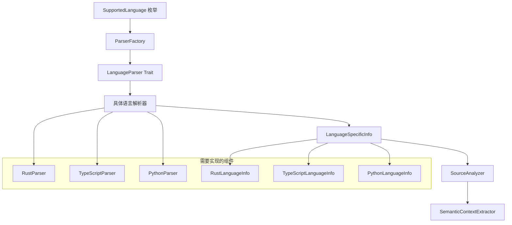

# semantic-diff 新语言扩展开发指南

## 概述

本指南详细介绍如何为 semantic-diff 添加新编程语言的支持。系统采用模块化设计，通过标准化的接口和工厂模式，使得添加新语言支持变得相对简单和标准化。

## 扩展架构概览

### 核心组件关系



## 添加新语言支持的步骤

### 步骤 1: 添加语言枚举

首先在 `SupportedLanguage` 枚举中添加新语言：

```rust
// crates/semantic-diff-core/src/parser/mod.rs

#[derive(Debug, Clone, Copy, PartialEq, Eq, Hash)]
pub enum SupportedLanguage {
    Go,
    Rust,        // 新增
    TypeScript,  // 新增
    Python,      // 新增
}

impl SupportedLanguage {
    /// 获取语言的显示名称
    pub fn display_name(&self) -> &'static str {
        match self {
            Self::Go => "Go",
            Self::Rust => "Rust",
            Self::TypeScript => "TypeScript",
            Self::Python => "Python",
        }
    }
    
    /// 获取语言的文件扩展名
    pub fn file_extensions(&self) -> &'static [&'static str] {
        match self {
            Self::Go => &["go"],
            Self::Rust => &["rs"],
            Self::TypeScript => &["ts", "tsx"],
            Self::Python => &["py", "pyi"],
        }
    }
}
```

### 步骤 2: 实现语言解析器

创建新的语言解析器文件，例如 `crates/semantic-diff-core/src/parser/rust.rs`：

```rust
//! Rust 语言解析器实现

use crate::parser::{LanguageParser, LanguageSpecificInfo};
use crate::Result;
use tree_sitter::{Language, Parser, Tree, Node};

/// Rust 语言解析器
pub struct RustParser {
    parser: Parser,
    language: Language,
}

impl RustParser {
    /// 创建新的 Rust 解析器
    pub fn new() -> Result<Self> {
        let language = tree_sitter_rust::LANGUAGE.into();
        let mut parser = Parser::new();
        parser.set_language(&language)
            .map_err(|e| crate::error::SemanticDiffError::TreeSitterError(e.to_string()))?;
        
        Ok(Self { parser, language })
    }
}

impl LanguageParser for RustParser {
    fn parse_source(&mut self, source: &str) -> Result<Tree> {
        self.parser
            .parse(source, None)
            .ok_or_else(|| crate::error::SemanticDiffError::ParseError(
                "Failed to parse Rust source code".to_string()
            ))
    }
    
    fn find_node_at_position<'a>(&self, tree: &'a Tree, line: u32, column: u32) -> Option<Node<'a>> {
        let point = tree_sitter::Point::new(line as usize, column as usize);
        tree.root_node().descendant_for_point_range(point, point)
    }
    
    fn get_node_text<'a>(&self, node: Node, source: &'a str) -> &'a str {
        &source[node.byte_range()]
    }
    
    fn walk_tree<F>(&self, root: Node, mut callback: F) 
    where 
        F: FnMut(Node) 
    {
        let mut cursor = root.walk();
        
        fn walk_recursive<F>(cursor: &mut tree_sitter::TreeCursor, callback: &mut F)
        where
            F: FnMut(Node),
        {
            callback(cursor.node());
            
            if cursor.goto_first_child() {
                loop {
                    walk_recursive(cursor, callback);
                    if !cursor.goto_next_sibling() {
                        break;
                    }
                }
                cursor.goto_parent();
            }
        }
        
        walk_recursive(&mut cursor, &mut callback);
    }
    
    fn language_name(&self) -> &'static str {
        "Rust"
    }
    
    fn file_extensions(&self) -> &'static [&'static str] {
        &["rs"]
    }
}
```

### 步骤 3: 创建语言特定信息结构

创建语言特定的信息结构，例如：

```rust
//! Rust 语言特定信息

use crate::parser::{LanguageSpecificInfo, Declaration, Import};
use std::any::Any;

/// Rust 语言特定信息
#[derive(Debug, Clone)]
pub struct RustLanguageInfo {
    /// Crate 名称
    pub crate_name: String,
    /// Use 声明
    pub use_statements: Vec<UseStatement>,
    /// 模块声明
    pub modules: Vec<ModuleDeclaration>,
    /// 项目声明（函数、结构体、枚举等）
    pub items: Vec<RustItem>,
    /// 属性
    pub attributes: Vec<Attribute>,
}

impl RustLanguageInfo {
    pub fn new(crate_name: String) -> Self {
        Self {
            crate_name,
            use_statements: Vec::new(),
            modules: Vec::new(),
            items: Vec::new(),
            attributes: Vec::new(),
        }
    }
    
    /// 获取所有函数声明
    pub fn functions(&self) -> Vec<&FunctionItem> {
        self.items.iter().filter_map(|item| {
            if let RustItem::Function(func) = item {
                Some(func)
            } else {
                None
            }
        }).collect()
    }
    
    /// 获取所有结构体声明
    pub fn structs(&self) -> Vec<&StructItem> {
        self.items.iter().filter_map(|item| {
            if let RustItem::Struct(struct_item) = item {
                Some(struct_item)
            } else {
                None
            }
        }).collect()
    }
    
    /// 获取所有枚举声明
    pub fn enums(&self) -> Vec<&EnumItem> {
        self.items.iter().filter_map(|item| {
            if let RustItem::Enum(enum_item) = item {
                Some(enum_item)
            } else {
                None
            }
        }).collect()
    }
}

impl LanguageSpecificInfo for RustLanguageInfo {
    fn as_any(&self) -> &dyn Any {
        self
    }
}

/// Use 声明
#[derive(Debug, Clone)]
pub struct UseStatement {
    pub path: String,
    pub alias: Option<String>,
    pub is_glob: bool,
    pub items: Vec<String>,
}

/// 模块声明
#[derive(Debug, Clone)]
pub struct ModuleDeclaration {
    pub name: String,
    pub visibility: Visibility,
    pub is_inline: bool,
}

/// Rust 项目类型
#[derive(Debug, Clone)]
pub enum RustItem {
    Function(FunctionItem),
    Struct(StructItem),
    Enum(EnumItem),
    Trait(TraitItem),
    Impl(ImplItem),
    Const(ConstItem),
    Static(StaticItem),
    Type(TypeAliasItem),
    Macro(MacroItem),
}

/// 函数项
#[derive(Debug, Clone)]
pub struct FunctionItem {
    pub name: String,
    pub visibility: Visibility,
    pub is_async: bool,
    pub is_const: bool,
    pub is_unsafe: bool,
    pub generics: Vec<GenericParam>,
    pub parameters: Vec<Parameter>,
    pub return_type: Option<String>,
    pub where_clause: Option<String>,
    pub body: String,
    pub attributes: Vec<Attribute>,
    pub start_line: u32,
    pub end_line: u32,
}

/// 结构体项
#[derive(Debug, Clone)]
pub struct StructItem {
    pub name: String,
    pub visibility: Visibility,
    pub generics: Vec<GenericParam>,
    pub fields: Vec<StructField>,
    pub is_tuple_struct: bool,
    pub attributes: Vec<Attribute>,
    pub start_line: u32,
    pub end_line: u32,
}

/// 枚举项
#[derive(Debug, Clone)]
pub struct EnumItem {
    pub name: String,
    pub visibility: Visibility,
    pub generics: Vec<GenericParam>,
    pub variants: Vec<EnumVariant>,
    pub attributes: Vec<Attribute>,
    pub start_line: u32,
    pub end_line: u32,
}

/// 可见性
#[derive(Debug, Clone, PartialEq)]
pub enum Visibility {
    Public,
    PublicCrate,
    PublicSuper,
    PublicIn(String),
    Private,
}

/// 泛型参数
#[derive(Debug, Clone)]
pub struct GenericParam {
    pub name: String,
    pub bounds: Vec<String>,
    pub default: Option<String>,
}

/// 参数
#[derive(Debug, Clone)]
pub struct Parameter {
    pub name: String,
    pub param_type: String,
    pub is_self: bool,
    pub is_mut: bool,
}

/// 结构体字段
#[derive(Debug, Clone)]
pub struct StructField {
    pub name: String,
    pub field_type: String,
    pub visibility: Visibility,
    pub attributes: Vec<Attribute>,
}

/// 枚举变体
#[derive(Debug, Clone)]
pub struct EnumVariant {
    pub name: String,
    pub fields: Vec<StructField>,
    pub discriminant: Option<String>,
    pub attributes: Vec<Attribute>,
}

/// 属性
#[derive(Debug, Clone)]
pub struct Attribute {
    pub name: String,
    pub args: Vec<String>,
}

// 其他项目类型的定义...
```

### 步骤 4: 实现 CST 导航器

为新语言实现 CST 导航功能：

```rust
//! Rust CST 导航器

use crate::parser::rust::*;
use tree_sitter::Node;

/// Rust CST 导航器
pub struct RustCstNavigator;

impl RustCstNavigator {
    pub fn new() -> Self {
        Self
    }
    
    /// 提取 Rust 语言特定信息
    pub fn extract_language_info(&self, root: Node, source: &str) -> RustLanguageInfo {
        let mut info = RustLanguageInfo::new("unknown".to_string());
        
        self.walk_node(root, source, &mut info);
        
        info
    }
    
    /// 遍历节点提取信息
    fn walk_node(&self, node: Node, source: &str, info: &mut RustLanguageInfo) {
        match node.kind() {
            "source_file" => {
                for child in node.children(&mut node.walk()) {
                    self.walk_node(child, source, info);
                }
            }
            "use_declaration" => {
                if let Some(use_stmt) = self.extract_use_statement(node, source) {
                    info.use_statements.push(use_stmt);
                }
            }
            "function_item" => {
                if let Some(func) = self.extract_function_item(node, source) {
                    info.items.push(RustItem::Function(func));
                }
            }
            "struct_item" => {
                if let Some(struct_item) = self.extract_struct_item(node, source) {
                    info.items.push(RustItem::Struct(struct_item));
                }
            }
            "enum_item" => {
                if let Some(enum_item) = self.extract_enum_item(node, source) {
                    info.items.push(RustItem::Enum(enum_item));
                }
            }
            "mod_item" => {
                if let Some(module) = self.extract_module_declaration(node, source) {
                    info.modules.push(module);
                }
            }
            _ => {
                // 递归处理子节点
                for child in node.children(&mut node.walk()) {
                    self.walk_node(child, source, info);
                }
            }
        }
    }
    
    /// 提取 use 声明
    fn extract_use_statement(&self, node: Node, source: &str) -> Option<UseStatement> {
        // 实现 use 声明提取逻辑
        let text = &source[node.byte_range()];
        
        // 简化实现，实际需要更复杂的解析
        Some(UseStatement {
            path: text.to_string(),
            alias: None,
            is_glob: text.contains("*"),
            items: Vec::new(),
        })
    }
    
    /// 提取函数项
    fn extract_function_item(&self, node: Node, source: &str) -> Option<FunctionItem> {
        let mut func = FunctionItem {
            name: String::new(),
            visibility: Visibility::Private,
            is_async: false,
            is_const: false,
            is_unsafe: false,
            generics: Vec::new(),
            parameters: Vec::new(),
            return_type: None,
            where_clause: None,
            body: String::new(),
            attributes: Vec::new(),
            start_line: node.start_position().row as u32,
            end_line: node.end_position().row as u32,
        };
        
        // 遍历函数节点的子节点
        for child in node.children(&mut node.walk()) {
            match child.kind() {
                "identifier" => {
                    if func.name.is_empty() {
                        func.name = source[child.byte_range()].to_string();
                    }
                }
                "visibility_modifier" => {
                    func.visibility = self.extract_visibility(child, source);
                }
                "parameters" => {
                    func.parameters = self.extract_parameters(child, source);
                }
                "type_identifier" | "primitive_type" | "generic_type" => {
                    if func.return_type.is_none() {
                        func.return_type = Some(source[child.byte_range()].to_string());
                    }
                }
                "block" => {
                    func.body = source[child.byte_range()].to_string();
                }
                _ => {}
            }
        }
        
        Some(func)
    }
    
    /// 提取结构体项
    fn extract_struct_item(&self, node: Node, source: &str) -> Option<StructItem> {
        // 实现结构体提取逻辑
        Some(StructItem {
            name: "placeholder".to_string(),
            visibility: Visibility::Private,
            generics: Vec::new(),
            fields: Vec::new(),
            is_tuple_struct: false,
            attributes: Vec::new(),
            start_line: node.start_position().row as u32,
            end_line: node.end_position().row as u32,
        })
    }
    
    /// 提取枚举项
    fn extract_enum_item(&self, node: Node, source: &str) -> Option<EnumItem> {
        // 实现枚举提取逻辑
        Some(EnumItem {
            name: "placeholder".to_string(),
            visibility: Visibility::Private,
            generics: Vec::new(),
            variants: Vec::new(),
            attributes: Vec::new(),
            start_line: node.start_position().row as u32,
            end_line: node.end_position().row as u32,
        })
    }
    
    /// 提取模块声明
    fn extract_module_declaration(&self, node: Node, source: &str) -> Option<ModuleDeclaration> {
        // 实现模块声明提取逻辑
        Some(ModuleDeclaration {
            name: "placeholder".to_string(),
            visibility: Visibility::Private,
            is_inline: false,
        })
    }
    
    /// 提取可见性
    fn extract_visibility(&self, node: Node, source: &str) -> Visibility {
        let text = &source[node.byte_range()];
        match text {
            "pub" => Visibility::Public,
            "pub(crate)" => Visibility::PublicCrate,
            "pub(super)" => Visibility::PublicSuper,
            _ if text.starts_with("pub(") => {
                let path = text.trim_start_matches("pub(").trim_end_matches(')');
                Visibility::PublicIn(path.to_string())
            }
            _ => Visibility::Private,
        }
    }
    
    /// 提取参数列表
    fn extract_parameters(&self, node: Node, source: &str) -> Vec<Parameter> {
        let mut parameters = Vec::new();
        
        for child in node.children(&mut node.walk()) {
            if child.kind() == "parameter" {
                if let Some(param) = self.extract_parameter(child, source) {
                    parameters.push(param);
                }
            }
        }
        
        parameters
    }
    
    /// 提取单个参数
    fn extract_parameter(&self, node: Node, source: &str) -> Option<Parameter> {
        let mut param = Parameter {
            name: String::new(),
            param_type: String::new(),
            is_self: false,
            is_mut: false,
        };
        
        for child in node.children(&mut node.walk()) {
            match child.kind() {
                "identifier" => {
                    if param.name.is_empty() {
                        let name = source[child.byte_range()].to_string();
                        param.is_self = name == "self";
                        param.name = name;
                    }
                }
                "mutable_pattern" => {
                    param.is_mut = true;
                }
                "type_identifier" | "primitive_type" | "reference_type" => {
                    param.param_type = source[child.byte_range()].to_string();
                }
                _ => {}
            }
        }
        
        Some(param)
    }
}
```

### 步骤 5: 更新工厂和检测器

在 `ParserFactory` 中注册新的解析器：

```rust
// crates/semantic-diff-core/src/parser/mod.rs

impl ParserFactory {
    pub fn create_parser(language: SupportedLanguage) -> Result<Box<dyn LanguageParser>> {
        match language {
            SupportedLanguage::Go => Ok(Box::new(GoParser::new()?)),
            SupportedLanguage::Rust => Ok(Box::new(RustParser::new()?)),
            SupportedLanguage::TypeScript => Ok(Box::new(TypeScriptParser::new()?)),
            SupportedLanguage::Python => Ok(Box::new(PythonParser::new()?)),
        }
    }
    
    pub fn detect_language(file_path: &Path) -> Option<SupportedLanguage> {
        let extension = file_path.extension()?.to_str()?;
        
        match extension {
            "go" => Some(SupportedLanguage::Go),
            "rs" => Some(SupportedLanguage::Rust),
            "ts" | "tsx" => Some(SupportedLanguage::TypeScript),
            "py" | "pyi" => Some(SupportedLanguage::Python),
            _ => None,
        }
    }
}
```

### 步骤 6: 添加依赖

在 `Cargo.toml` 中添加新语言的 tree-sitter 依赖：

```toml
[workspace.dependencies]
# 现有依赖...
tree-sitter-rust = "0.23"
tree-sitter-typescript = "0.23"
tree-sitter-python = "0.23"

[dependencies]
# 现有依赖...
tree-sitter-rust = { workspace = true }
tree-sitter-typescript = { workspace = true }
tree-sitter-python = { workspace = true }
```

### 步骤 7: 编写测试

为新语言创建全面的测试：

```rust
// crates/semantic-diff-core/src/parser/rust/tests.rs

#[cfg(test)]
mod tests {
    use super::*;
    use crate::parser::LanguageParser;

    #[test]
    fn test_rust_parser_creation() {
        let parser = RustParser::new();
        assert!(parser.is_ok());
        
        let parser = parser.unwrap();
        assert_eq!(parser.language_name(), "Rust");
        assert_eq!(parser.file_extensions(), &["rs"]);
    }

    #[test]
    fn test_parse_simple_rust_function() {
        let mut parser = RustParser::new().unwrap();
        let source = r#"
fn hello_world() {
    println!("Hello, world!");
}
"#;
        
        let tree = parser.parse_source(source).unwrap();
        let root = tree.root_node();
        
        assert_eq!(root.kind(), "source_file");
        assert!(root.child_count() > 0);
    }

    #[test]
    fn test_extract_rust_function_info() {
        let mut parser = RustParser::new().unwrap();
        let source = r#"
pub async fn process_data(data: &str) -> Result<String, Error> {
    Ok(data.to_uppercase())
}
"#;
        
        let tree = parser.parse_source(source).unwrap();
        let navigator = RustCstNavigator::new();
        let info = navigator.extract_language_info(tree.root_node(), source);
        
        let functions = info.functions();
        assert_eq!(functions.len(), 1);
        
        let func = &functions[0];
        assert_eq!(func.name, "process_data");
        assert_eq!(func.visibility, Visibility::Public);
        assert!(func.is_async);
        assert!(!func.is_const);
        assert!(!func.is_unsafe);
    }

    #[test]
    fn test_extract_rust_struct_info() {
        let mut parser = RustParser::new().unwrap();
        let source = r#"
#[derive(Debug, Clone)]
pub struct User {
    pub id: u64,
    name: String,
    email: Option<String>,
}
"#;
        
        let tree = parser.parse_source(source).unwrap();
        let navigator = RustCstNavigator::new();
        let info = navigator.extract_language_info(tree.root_node(), source);
        
        let structs = info.structs();
        assert_eq!(structs.len(), 1);
        
        let struct_item = &structs[0];
        assert_eq!(struct_item.name, "User");
        assert_eq!(struct_item.visibility, Visibility::Public);
        assert!(!struct_item.is_tuple_struct);
    }

    #[test]
    fn test_extract_rust_enum_info() {
        let mut parser = RustParser::new().unwrap();
        let source = r#"
pub enum Status {
    Pending,
    Processing { progress: f64 },
    Completed(String),
    Failed(Error),
}
"#;
        
        let tree = parser.parse_source(source).unwrap();
        let navigator = RustCstNavigator::new();
        let info = navigator.extract_language_info(tree.root_node(), source);
        
        let enums = info.enums();
        assert_eq!(enums.len(), 1);
        
        let enum_item = &enums[0];
        assert_eq!(enum_item.name, "Status");
        assert_eq!(enum_item.visibility, Visibility::Public);
    }

    #[test]
    fn test_find_node_at_position() {
        let mut parser = RustParser::new().unwrap();
        let source = r#"fn main() {
    println!("Hello");
}"#;
        
        let tree = parser.parse_source(source).unwrap();
        
        // 查找函数名位置的节点
        let node = parser.find_node_at_position(&tree, 0, 3);
        assert!(node.is_some());
        
        let node = node.unwrap();
        let text = parser.get_node_text(node, source);
        assert_eq!(text, "main");
    }

    #[test]
    fn test_walk_tree() {
        let mut parser = RustParser::new().unwrap();
        let source = r#"fn test() { let x = 42; }"#;
        
        let tree = parser.parse_source(source).unwrap();
        let root = tree.root_node();
        
        let mut node_kinds = Vec::new();
        parser.walk_tree(root, |node| {
            node_kinds.push(node.kind().to_string());
        });
        
        assert!(node_kinds.contains(&"source_file".to_string()));
        assert!(node_kinds.contains(&"function_item".to_string()));
        assert!(node_kinds.contains(&"identifier".to_string()));
    }
}
```

### 步骤 8: 集成测试

创建集成测试验证新语言的完整工作流程：

```rust
// crates/semantic-diff-core/tests/integration_rust_test.rs

use semantic_diff_core::{
    analyzer::SourceAnalyzer,
    extractor::SemanticContextExtractor,
    generator::CodeSliceGenerator,
    parser::SupportedLanguage,
};
use tempfile::TempDir;
use std::path::PathBuf;

#[test]
fn test_rust_end_to_end_workflow() {
    let temp_dir = TempDir::new().unwrap();
    let file_path = temp_dir.path().join("test.rs");
    
    let rust_code = r#"
use std::collections::HashMap;

#[derive(Debug, Clone)]
pub struct UserService {
    users: HashMap<u64, User>,
}

#[derive(Debug, Clone)]
pub struct User {
    pub id: u64,
    pub name: String,
    pub email: String,
}

impl UserService {
    pub fn new() -> Self {
        Self {
            users: HashMap::new(),
        }
    }
    
    pub fn add_user(&mut self, user: User) -> Result<(), String> {
        if self.users.contains_key(&user.id) {
            return Err("User already exists".to_string());
        }
        
        self.users.insert(user.id, user);
        Ok(())
    }
    
    pub fn get_user(&self, id: u64) -> Option<&User> {
        self.users.get(&id)
    }
}
"#;
    
    std::fs::write(&file_path, rust_code).unwrap();
    
    // 1. 分析 Rust 文件
    let mut analyzer = SourceAnalyzer::new_for_language(SupportedLanguage::Rust).unwrap();
    let source_file = analyzer.analyze_file(&file_path).unwrap();
    
    // 验证语言检测
    assert_eq!(source_file.language, SupportedLanguage::Rust);
    
    // 验证解析结果
    assert!(!source_file.source_code.is_empty());
    assert!(!source_file.functions.is_empty());
    
    // 2. 提取语义上下文
    let extractor = SemanticContextExtractor::new();
    
    for function in &source_file.functions {
        let context = extractor.extract_context(function, &[source_file.clone()]).unwrap();
        
        // 验证上下文提取
        assert_eq!(context.main_function.name, function.name);
        assert!(!context.related_types.is_empty());
        
        // 3. 生成代码切片
        let generator = CodeSliceGenerator::new();
        let code_slice = generator.generate_slice(&context, &[]).unwrap();
        
        // 验证代码切片生成
        assert!(!code_slice.function_definitions.is_empty());
        assert!(!code_slice.type_definitions.is_empty());
        
        println!("Successfully processed Rust function: {}", function.name);
    }
}

#[test]
fn test_rust_complex_structures() {
    let temp_dir = TempDir::new().unwrap();
    let file_path = temp_dir.path().join("complex.rs");
    
    let complex_rust_code = r#"
use std::sync::{Arc, Mutex};
use std::collections::HashMap;
use tokio::sync::RwLock;

pub trait Storage<T> {
    async fn save(&self, key: String, value: T) -> Result<(), StorageError>;
    async fn load(&self, key: &str) -> Result<Option<T>, StorageError>;
}

#[derive(Debug, thiserror::Error)]
pub enum StorageError {
    #[error("Key not found: {key}")]
    NotFound { key: String },
    #[error("Serialization error: {0}")]
    Serialization(#[from] serde_json::Error),
    #[error("IO error: {0}")]
    Io(#[from] std::io::Error),
}

pub struct MemoryStorage<T> {
    data: Arc<RwLock<HashMap<String, T>>>,
}

impl<T> MemoryStorage<T> 
where 
    T: Clone + Send + Sync + 'static,
{
    pub fn new() -> Self {
        Self {
            data: Arc::new(RwLock::new(HashMap::new())),
        }
    }
}

#[async_trait::async_trait]
impl<T> Storage<T> for MemoryStorage<T>
where
    T: Clone + Send + Sync + 'static,
{
    async fn save(&self, key: String, value: T) -> Result<(), StorageError> {
        let mut data = self.data.write().await;
        data.insert(key, value);
        Ok(())
    }
    
    async fn load(&self, key: &str) -> Result<Option<T>, StorageError> {
        let data = self.data.read().await;
        Ok(data.get(key).cloned())
    }
}
"#;
    
    std::fs::write(&file_path, complex_rust_code).unwrap();
    
    // 测试复杂 Rust 结构的解析
    let mut analyzer = SourceAnalyzer::new_for_language(SupportedLanguage::Rust).unwrap();
    let source_file = analyzer.analyze_file(&file_path).unwrap();
    
    // 验证复杂结构解析
    assert_eq!(source_file.language, SupportedLanguage::Rust);
    assert!(!source_file.functions.is_empty());
    
    // 验证泛型和异步函数的处理
    let async_functions: Vec<_> = source_file.functions.iter()
        .filter(|f| f.name.contains("save") || f.name.contains("load"))
        .collect();
    
    assert!(!async_functions.is_empty());
    
    println!("Successfully parsed complex Rust structures");
}
```

## 最佳实践和注意事项

### 1. Tree-sitter 语法规则

每种语言的 Tree-sitter 语法规则不同，需要：

- 仔细研究目标语言的 Tree-sitter 语法文档
- 使用 Tree-sitter 的调试工具查看 AST 结构
- 编写充分的测试覆盖各种语言结构

### 2. 性能考虑

- 实现高效的节点遍历算法
- 避免不必要的字符串分配
- 使用适当的数据结构存储语言信息
- 考虑并发安全性

### 3. 错误处理

- 提供详细的错误信息
- 实现优雅的错误恢复
- 处理语法错误和不完整的代码

### 4. 测试策略

- 单元测试：测试解析器的各个功能
- 集成测试：测试完整的工作流程
- 性能测试：验证大型文件的处理能力
- 边界测试：测试错误输入和边界情况

### 5. 文档和示例

- 提供详细的 API 文档
- 包含使用示例和最佳实践
- 说明语言特定的限制和注意事项

## 完整示例：TypeScript 支持

以下是添加 TypeScript 支持的完整示例：

```rust
// crates/semantic-diff-core/src/parser/typescript.rs

use crate::parser::{LanguageParser, LanguageSpecificInfo};
use crate::Result;
use tree_sitter::{Language, Parser, Tree, Node};
use std::any::Any;

/// TypeScript 语言解析器
pub struct TypeScriptParser {
    parser: Parser,
    language: Language,
}

impl TypeScriptParser {
    pub fn new() -> Result<Self> {
        let language = tree_sitter_typescript::LANGUAGE_TYPESCRIPT.into();
        let mut parser = Parser::new();
        parser.set_language(&language)
            .map_err(|e| crate::error::SemanticDiffError::TreeSitterError(e.to_string()))?;
        
        Ok(Self { parser, language })
    }
}

impl LanguageParser for TypeScriptParser {
    fn parse_source(&mut self, source: &str) -> Result<Tree> {
        self.parser
            .parse(source, None)
            .ok_or_else(|| crate::error::SemanticDiffError::ParseError(
                "Failed to parse TypeScript source code".to_string()
            ))
    }
    
    fn find_node_at_position<'a>(&self, tree: &'a Tree, line: u32, column: u32) -> Option<Node<'a>> {
        let point = tree_sitter::Point::new(line as usize, column as usize);
        tree.root_node().descendant_for_point_range(point, point)
    }
    
    fn get_node_text<'a>(&self, node: Node, source: &'a str) -> &'a str {
        &source[node.byte_range()]
    }
    
    fn walk_tree<F>(&self, root: Node, mut callback: F) 
    where 
        F: FnMut(Node) 
    {
        // 实现树遍历逻辑
    }
    
    fn language_name(&self) -> &'static str {
        "TypeScript"
    }
    
    fn file_extensions(&self) -> &'static [&'static str] {
        &["ts", "tsx"]
    }
}

/// TypeScript 语言特定信息
#[derive(Debug, Clone)]
pub struct TypeScriptLanguageInfo {
    pub imports: Vec<ImportStatement>,
    pub exports: Vec<ExportStatement>,
    pub interfaces: Vec<InterfaceDeclaration>,
    pub classes: Vec<ClassDeclaration>,
    pub functions: Vec<FunctionDeclaration>,
    pub types: Vec<TypeAliasDeclaration>,
    pub enums: Vec<EnumDeclaration>,
}

impl LanguageSpecificInfo for TypeScriptLanguageInfo {
    fn as_any(&self) -> &dyn Any {
        self
    }
}

// TypeScript 特定的数据结构定义...
```

## 总结

添加新语言支持的关键步骤：

1. **扩展语言枚举**：在 `SupportedLanguage` 中添加新语言
2. **实现解析器**：创建实现 `LanguageParser` trait 的解析器
3. **定义语言信息**：创建语言特定的信息结构
4. **实现导航器**：提供 CST 导航和信息提取功能
5. **更新工厂**：在 `ParserFactory` 中注册新解析器
6. **添加依赖**：引入相应的 tree-sitter 语言包
7. **编写测试**：创建全面的单元测试和集成测试
8. **更新文档**：提供使用示例和最佳实践

通过遵循这个标准化的流程，可以相对容易地为 semantic-diff 添加新的编程语言支持，同时保持代码的一致性和可维护性。